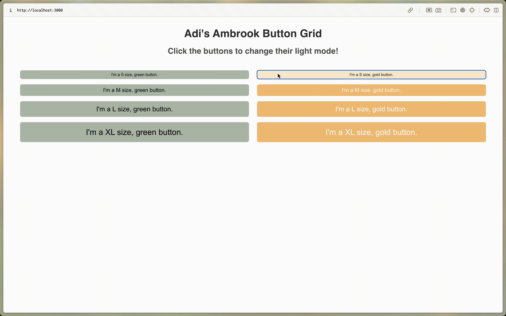

# Ambrook Button Implementation

## Introduction 

In this repo, I have a quick implementation of the `AmButton`, as outlined in the article [How Engineers Design: Full-Stack Design Sytstems at Ambrook](https://ambrook.com/blog/engineering/how-engineers-design-full-stack-design-systems-at-ambrook).

This repo is not guaranteed to enforce best practices for front-end development. I'm mostly putting together this repo to develop some familiarity with TypeScript and the engineering approach described in the blog post above. 

## Startup

Given that I already had `node.js` is installed, I used the following steps to create a locally hosted application.

1. `npx create-react-app a-button --template typescript`
2. Write code for app
3. `npm start`

I also installed required packages as needed. 

## Repo Structure

I have the following file structure:

```
| app_dir
└─── a-button
    | node_modules
    | src
    └─── buttons
        | AmButton.style.tsx
        | AmButton.tsx     
    └─── styles
        | buttonsizes.ts
        | colors.ts
        | sizes.ts
    | App.tsx
    | other files...
    | package-lock.json
    | package.json
    | tsconfig.json
| README.md
| AmbrookButton.html
```

## Result

The app is saved as a `.html` file and included in this repo as `AmbrookButton.html`. Note that downloading this file will not include any responsiveness in the app. Specifically, the buttons will not function when clicked on (this is just the saved html). 

Here is the app in use:


